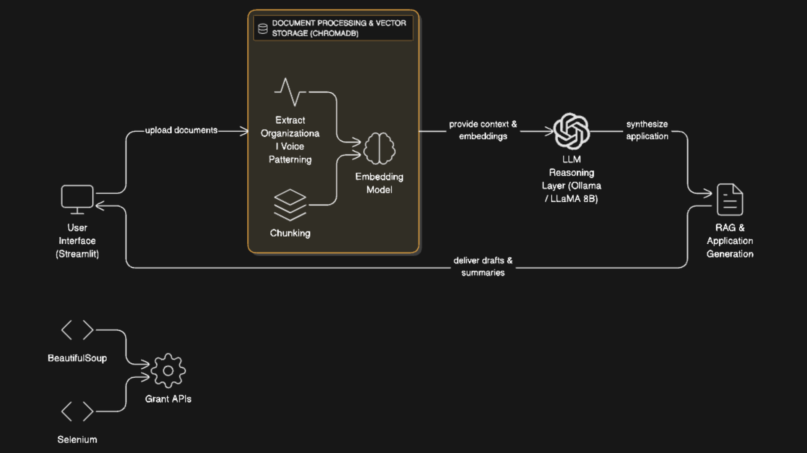

# AI-Powered Grant Application Assistant

An intelligent grant discovery and application generator built for nonprofit organizations. Runs entirely on your local machine using open-source AI models - complete data privacy, zero API costs.

---



---

## What It Does

This system helps nonprofits automatically discover relevant grant opportunities and generate draft applications that sound like your organization wrote them. It learns from your past successful applications and maintains your authentic voice.

**Three Core Features:**

1. **Document Processing** - Analyzes 50+ past grant applications to learn your organizational voice, mission, and successful writing patterns
2. **Grant Discovery** - Searches databases to find relevant funding opportunities matching your priorities
3. **Application Generation** - Creates draft applications using RAG (Retrieval-Augmented Generation) that incorporate examples from your history

## Why This Approach

**Local AI**: Everything runs on your computer using Ollama. Your grant documents stay private, no data leaves your machine, and there are no per-request costs.

**Learns Your Voice**: By analyzing past successful applications, the system understands how you describe programs, what metrics you emphasize, and what tone works for your organization.

**Retrieval-Augmented Generation**: When writing new applications, the system finds relevant examples from your past grants and uses them as references - so the AI generates content based on your actual successful writing, not generic nonprofit language.

## Tech Stack

- **AI Model**: Ollama with Llama 3.1 8B (4.9 GB, runs on 16GB RAM)
- **Vector Database**: ChromaDB for document embeddings
- **Embeddings**: HuggingFace BAAI/bge-small-en-v1.5 (local, CPU-based)
- **Framework**: LlamaIndex for RAG implementation
- **Frontend**: Streamlit web interface
- **Language**: Python 3.9+

## Quick Start

### Prerequisites

- Python 3.9+
- 16GB RAM minimum
- 10GB+ free disk space

### Installation

**1. Install Ollama**

Download from https://ollama.ai/download

Pull the model (4.9 GB):
```bash
ollama pull llama3.1:8b
```

Verify:
```bash
ollama list
# Should show: llama3.1:8b
```

**2. Setup Project**

```bash
git clone <your-repo-url>
cd grantlab

# Create virtual environment
python -m venv venv

# Activate (Windows)
venv\Scripts\activate

# Activate (macOS/Linux)
source venv/bin/activate

# Install dependencies
pip install -r requirements.txt
```

**3. Configure Environment**

```bash
cp .env.example .env
```

The defaults in `.env` work fine:
```
OLLAMA_BASE_URL=http://localhost:11434
LLM_MODEL=llama3.1:8b
EMBEDDING_MODEL=BAAI/bge-small-en-v1.5
CHROMA_PERSIST_DIR=./data/chroma_db
```

**4. Run**

```bash
streamlit run app.py
```

Opens at http://localhost:8501

## How to Use

### Tab 1: Process Documents
Click "Process Grant Documents" to load 53 Cambio Labs examples and create searchable index (~6 seconds).

### Tab 2: Discover Grants
Click "Search for Grants" to view sample opportunities. Shows NSF AI Education ($500K) and DOL Workforce ($750K) grants.

### Tab 3: Generate Application
1. Select a grant from dropdown
2. Choose sections (Project Overview, Description, Outcomes, etc.)
3. Click "Generate Application Draft"
4. AI writes content in organizational voice (30-60 seconds per section)

### Tab 4: Refine Application
Provide feedback and click "Refine Application" to improve generated content.


## Performance

| Component | Time |
|-----------|------|
| Document Loading | ~6 seconds |
| Grant Discovery | ~1 second |
| AI Generation (per section) | 30-60 seconds |
| First Run (embedding download) | ~60 seconds |
| Subsequent Runs | <5 seconds |

**System Resource Usage:**
- Memory during generation: 6-7 GB
- Total disk usage: 6.5 GB
- Model loads once, stays in memory

## Testing

Run full system test:
```bash
python test_system.py
```

Tests all components: document processing (53 files), vector store indexing, grant discovery, AI generation.

## Common Issues

**Ollama Not Running**
```bash
# Check Ollama status
curl http://localhost:11434

# Should return: "Ollama is running"
# If not, start it:
ollama serve
```

**Encoding Errors**
System automatically falls back to Windows-1252 encoding (already implemented).

**Slow First Run**
Embedding model downloads on first run (~133 MB). Subsequent runs use cached model.

**Memory Issues**
Close other applications. System needs 16GB+ RAM. Model loads on first generation request.

## Project Structure

```
grantlab/
├── src/
│   ├── processing/      # Document parsing and chunking
│   ├── rag/            # Vector store and embeddings
│   ├── discovery/      # Grant scraping and search
│   └── generation/     # AI-powered application writing
├── config/             # Settings and configuration
├── examples/           # 53 Cambio grant examples
├── docs/              # Comprehensive documentation
├── data/              # Vector database (auto-created)
├── app.py             # Streamlit interface
└── test_system.py     # End-to-end testing
```

## Documentation

See `docs/` folder for comprehensive guides:
- `grantlab_doc.md` - Complete technical documentation
- `comprehensive_guide.rmd` - Theory to implementation guide

## Status

Fully functional - all core features working. Last tested October 26, 2025.

- Document processing: All 53 files loaded
- Vector store: Operational with local embeddings
- Grant discovery: Sample grants available
- AI generation: Professional quality output
- Web interface: Stable and responsive
